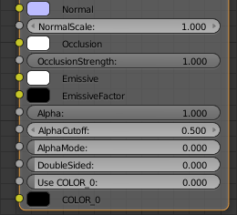

User Documentation
------------------

### Materials

### PBR Materials
At point of writing, the PBR materials are simulated with Cycles using a specific node tree encapsulated in a node group.
Two node groups are provided, one for the metallic roughness and one for the specular glossiness workflow.

Even possible in the Cycles node editor, specific requirements have to be fulfilled, that all parameters
are exported to the glTF 2.0 file format successfully.
TODO: Explain further.

All PBR materials share the same input parameters, which are listed in the following table.

|Material parameter export   |Node group only|Texture only|Attribute only|Comments                                        |
|----------------------------|:-------------:|:----------:|:------------:|------------------------------------------------|
|Normal texture              |               |X           |              |                                                |
|Normal strength             |X              |            |              |                                                |
|Normal texture coordinate   |               |            |              |'UV' from 'UV MAP' to 'Vector'                  |
|Occlusion texture           |               |X           |              |                                                |
|Occlusion strength          |X              |            |              |                                                |
|Occlusion texture coordinate|               |            |              |'UV' from 'UV MAP' to 'Vector'                  |
|Emissive texture            |               |X           |              |                                                |
|Emissive factor             |X              |            |              |                                                |
|Emissive texture coordinate |               |            |              |'UV' from 'UV MAP' to 'Vector'                  |
|Alpha texture channel       |X              |            |              |                                                |
|Alpha cutoff                |X              |            |              |                                                |
|Alpha mode                  |X              |            |              |                                                |
|Double sided                |X              |            |              |                                                |
|COLOR_0                     |               |            |X             |'Name' from 'Attribute' to first 'Vertex Colors'|

#### PBR Metallic Roughness

#### PBR Specular Glossiness

The specular glossiness material is not part of core glTF 2.0. The material is defined by the extension `KHR_materials_pbrSpecularGlossiness`.

#### CMN Blinn-Phong

The common Blinn-Phong material is not part of core glTF 2.0. The material is defined by the extension `KHR_materials_cmnBlinnPhong`.
A valid glTF 2.0 file can contain no materials. To avoid an unwanted export of this material type, the option for this material has explicitly be enabled. This common material is not dependent on any node group, as the materials from `Blender Render` are used. As the Blender material has more settings and options than defined in the common Blinn-Phong material, only the following parameters are exported:

TODO: List of exported textures and parameters.