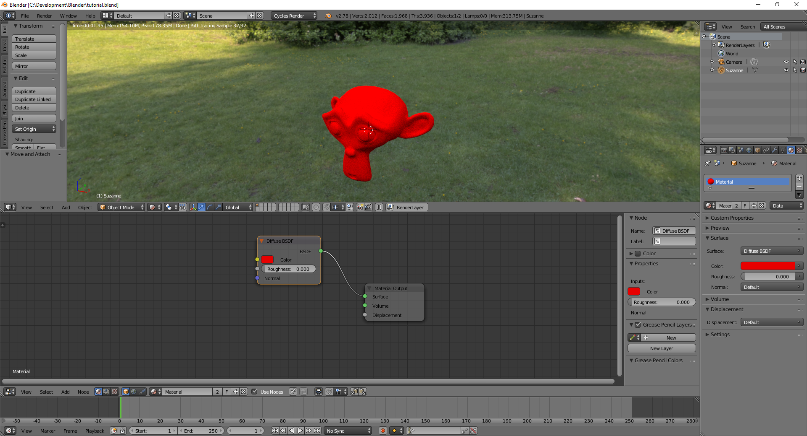
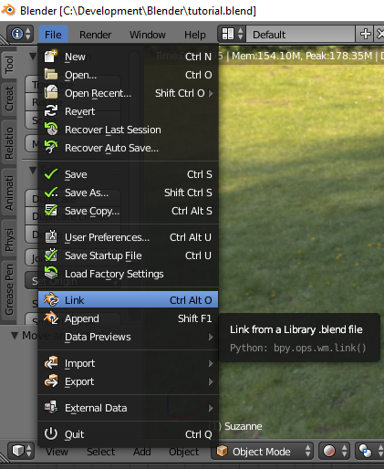
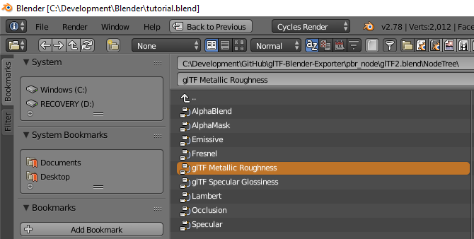
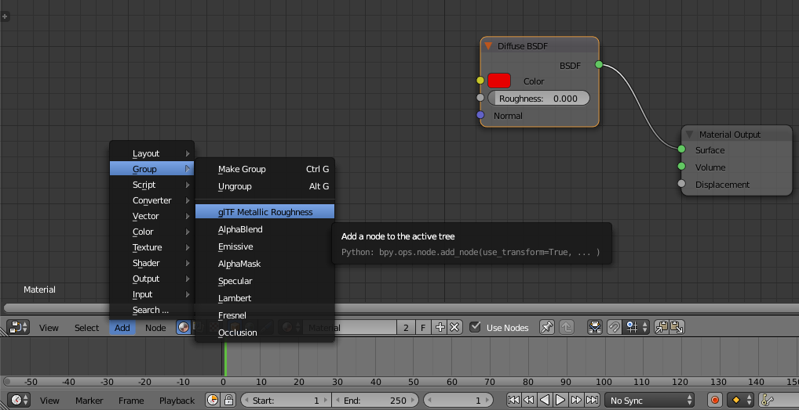
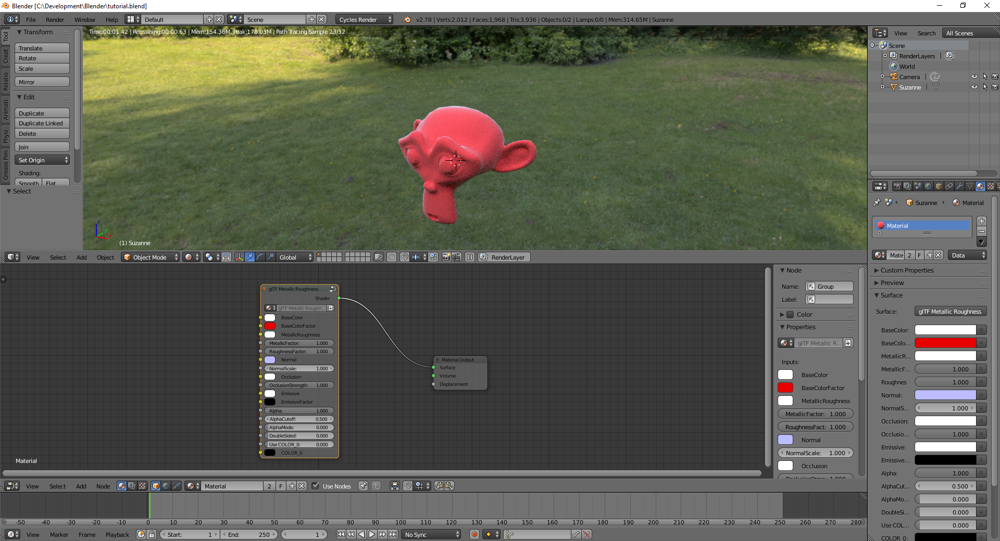
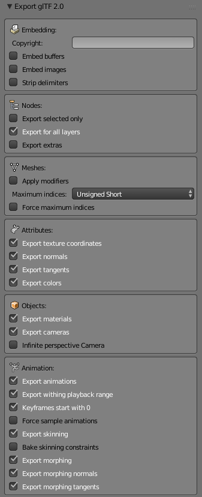
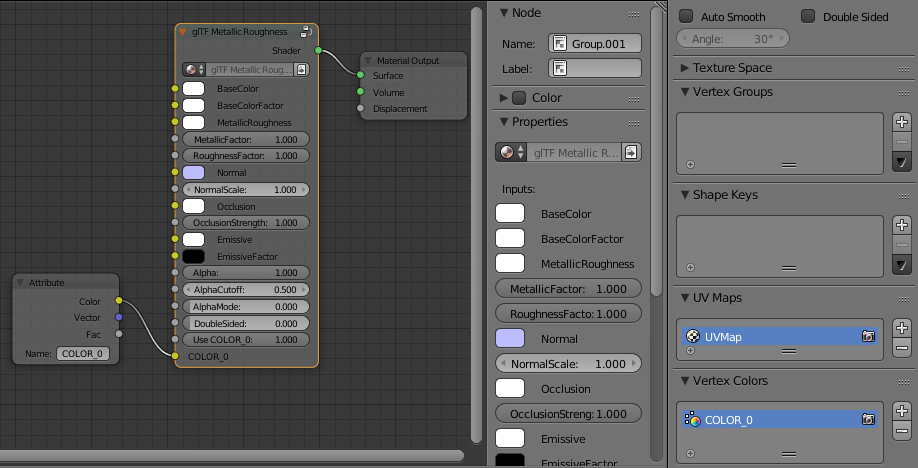
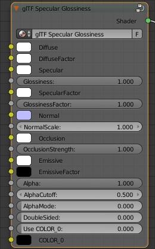

User Documentation
------------------

### glTF 2.0 Materials

glTF 2.0 introduced two PBR materials: The Metallic-Roughness and Specular-Glossiness workflow. As the Metallic-Roughness is integrated into core glTF 2.0, details are explained for this workflow. For Specular-Glossiness, it is similar or almost the same.

At point of writing, Blender supports two material settings: One for `Blender Render` and one for `Cycles Render`. Fortunately, the glTF 2.0 Materials can be simulated using the `Cycles Render` by implementing a custom node tree. Advantage is, that the preview of the Cycles output is almost 1:1 to the expected rendering output when using the glTF 2.0 materials.

However, this custom node tree needs to be imported and linked to a Blender file. For the future, it is planned to use the `Eevee` shader node, which will replace the current node group.

#### Integrating glTF 2.0 Materials

Following picture shows a basic Blender scene using the Cycles renderer.

If this scene would be exported, the perspective camera and Suzanne are written to the glTF 2.0 file. However, this scene would not contain any materials. As this glTF 2.0 file is valid, any glTF 2.0 render would use a default material.  

The reason for this is, that with Cycles much more complex PBR shaders can be created, which cannot be exported to glTF 2.0 in this case. In this concrete Blender scene, the exporter skips the material.

In the following steps it is explained, how to integrate a glTF 2.0 material:

At first, it is required to link or append the Blender file, which contains the glTF 2.0 materials.

It is recommended for development to link the file, as any possible updates are automatically updated. As relative paths are used, this is not optimal for deployment, as the material information would get lost and finally the Blender file is broken.  
For deployment, append is recommended, as even the final Blender file increases, any required information is kept in ths deployed file.

Navigate to the `glTF2.blend` file included in this repository, select `NodeTree` and finally the `glTF Metallic Roughness` entry. For a Specular-Glossiness material, choose `glTF Specular Glossiness`. After linking or appending the entry, the glTF 2.0 material is ready to be used in this Blender file.

For using the glTF 2.0 material, the current Material of Suzanne has to be altered:

Add the node group `glTF Metallic Roughness` to the material, delete the `Diffuse BSDF` shader and connect the node group to the `Material Output` node.

After changing the `baseColorFactor` property, Suzanne has again the red color.

That's it!

If this scene is exported, the glTF 2.0 file does contain the material.

### Export settings

The default exporter settings are configured in such a way, that the generated glTF 2.0 scene is almost identical to the Blender scene. However, in some cases, applying different settings do result in a better export result. Furthermore, the export settings allow an individual and adapted export depending on the users expectation.

The following sections explains the different export settings.

### Embedding

#### Copyright

If this field is not empty, the given string is exported into the `copyright` property. This entry is not stored in the Blender scene file.

#### Embed buffers

By default, any binary data like vertices and animations are exported into a `.bin` file. Enabling this option, the given data is embedded inside the `.gltf` file. This option is only availabe in the `.gltf` export, as for `.glb`, the integration is done automatically.

#### Embed images

By default, any image is saved as a `.png` file. Enabling this option, the given images are embedded inside the `.gltf` file. This option is only availabe in the `.gltf` export, as for `.glb`, the integration is done automatically.

#### Strip delimiters

By default, the generated `.gltf` file contains line breaks and indentations for better human readability. If enabled, the exporter glTF 2.0 JSON file is tightly packed. This option is only availabe in the `.gltf` export, as for `.glb`, the stripping is applied automatically.

### Nodes

#### Export selected only

By default, all objects and it assets are exported. If enabled, only the selected items are exported.

#### Export for all layers

In Blender, objects can be assigned to different layers. By default, all objects on all layers are exported. It is a common use case, that helper objects are placed on other layers and only the first layer contains the correct visual output. In such a case, objects could appear dublicated or in a wrong context. Enable this setting, if only the objects on the first layers should be exported.

#### Export extras

In Blender, for some objects, it is possible to set custom properties. If enabled, these custom properties are exported into the `extras` property of the glTF 2.0 file.

### Meshes

#### Apply modifiers

Blender has the feature of modifiers, which most of them cannot be exported to glTF 2.0 by default. When exporting, apply these specific modifiers for a correct visual output of the scene.
If this setting is enabled, all modifiers are applied automatically. Drawback is, that skinning and morphing is backed as well.

#### Maximum indices

By default, vertex indices are exported as `Unsigned short` data type and is feasible in most cases. However, for large primitives, the mesh has to be split into several primitives, which causes a longer export time. Changing this value to `Unsigned integer`, no splitting has to be performed. Tradeoff is larger size of of the binary file. If `Unsigned byte` is used, the size of the vertex indices is minimal, but the amount of splitted primitives increases.

#### Force maximum indices

By default, if vertex indices can be represented with a smaller type size without splitting the primitive, the minimal type size is used. If this setting is enabled, all primitives are forced to have the same type size, as defined in the maximum indices field.

### Attributes

#### Export texture coordinates

By default, if present, texture coordinates are exported.

#### Export normals

By default normals are exported.

#### Export tangents

By default, if they can be calculated, tangents are exported.

#### Export colors

By default, if present, vertex colors are exported.

### Objects

#### Export materials

By default, if glTF 2.0 materials are used, materials are exported.

#### Export cameras

By default cameras are exported.

#### Infinite perspective camera

By default, all perspective cameras are exported as finite perspective cameras. By enabling this option, all perspective cameras are exported as infinite ones.

### Animation

#### Export animations

By default, all animations are exported.

#### Export within playback range

By default, all animations are exported within the playback range. If disabled, all animation data is exported. This property is only visible, if export animations is enabled.

#### Export current frame

If the animations are not exported, this option gets visible. By default, the current frame is exported. If not, frame `0` is exported.

#### Export skinning

By default, all skinning data and animations are exported. If disabled, the armature position is exported.

#### Bake skinning constraints

If export skinning is enabled, this option is visible. If inverse kinematics are used, this option has to be enabled for a correct glTF 2.0 export. Tradoff is, because the animations are baked, that the animation data export is getting larger. 

#### Export morphing

By default, morphing animation data is exported.

#### Export morphing normals

By default, morphing normal targets are exported. If disabled, tangents are not exported as well. Property is only visible, if export morphing is enabled.

#### Export morphing tangents

By default, morphing tangent targets are exported. If disabled, tangents are not exported. Property is only visible, if export morphing and morphing normals is enabled.

---

### Materials

### PBR Materials
At point of writing, the PBR materials are simulated with Cycles using a specific node tree encapsulated in a node group.
Two node groups are provided, one for the metallic roughness and one for the specular glossiness workflow.

Even possible in the Cycles node editor, specific requirements have to be fulfilled, that all parameters are exported to the glTF 2.0 file format successfully:  

- If a parameter is marked as 'Node group only', the parameter has to be changed in the node group. Any input by a node is ignored.  
- If a parameter is marked as 'Texture only', the parameter in the node group contains the default value. Changing this value is ignored. Only an 'Image Texture' input link is accepted.
- If a parameter is marked as 'Attribute only', the parameter in the node group contains the default value. Changing this value is ignored. Only an 'Attribute' input link is accepted.

All PBR materials share the same input parameters, which are listed in the following table:

|Material parameter export   |Node group only|Texture only|Attribute only|Comments                                        |
|----------------------------|:-------------:|:----------:|:------------:|------------------------------------------------|
|Normal texture              |               |X           |              |                                                |
|Normal strength             |X              |            |              |                                                |
|Normal texture coordinate   |               |            |              |'UV' from 'UV MAP' to 'Vector'                  |
|Occlusion texture           |               |X           |              |                                                |
|Occlusion strength          |X              |            |              |                                                |
|Occlusion texture coordinate|               |            |              |'UV' from 'UV MAP' to 'Vector'                  |
|Emissive texture            |               |X           |              |                                                |
|Emissive factor             |X              |            |              |                                                |
|Emissive texture coordinate |               |            |              |'UV' from 'UV MAP' to 'Vector'                  |
|Alpha texture channel       |X              |            |              |                                                |
|Alpha cutoff                |X              |            |              |                                                |
|Alpha mode                  |X              |            |              |                                                |
|Double sided                |X              |            |              |                                                |
|COLOR_0                     |               |            |X             |'Name' from 'Attribute' to first 'Vertex Colors'|

##### Alpha

By default, the alpha mode is 'OPAQUE' and set to 'BLEND', if 
- the BaseColorFactor or DiffuseFactor alpha value is less than 1.0  
- the Alpha channel from the BaseColor or Diffuse image texture is connected.  

Please note, that separate alpha maps are currently not specified in glTF 2.0 and so not working.
The alpha channel has to be linked from the above defined image textures. Following picture shows the correct and simple usage for the glTF Metallic Roughness node:

To use 'MASK' for blending, the AlphaMode has to be set from 0.0 to 1.0. In this case, as specified by glTF 2.0, the AlphaCutoff value is used and exported.

##### Double sided

In glTF 2.0, the information if a mesh has to be rendered double sided or not, is stored in the material and not the mesh. By default, double sided is disabled and if a glTF 2.0 scene is exported, the back faces are culled. If a mesh should be renderered without back face culling, enable the double sided material by setting the slider to 1.0.

##### Vertex color usage

By default, `Use COLOR_0` is disabled and the slider has to be set to 1.0 for enabling it.

Furthermore, an `Attribute` input has to be linked to `COLOR_0` for a correct export.

In the `Name` property field of the `Attribute` node, the string of the `Vertex Colors` has to be entered. In following picture, the name is `COLOR_0` but any name can be used.

#### PBR Metallic Roughness

#### PBR Specular Glossiness

The specular glossiness material is not part of core glTF 2.0. The material is defined by the extension `KHR_materials_pbrSpecularGlossiness`.

---

### External Tools

The following section describes several tools, how they can optimal be used with the Blender glTF 2.0 exporter. 

#### Substance Painter
[Substance Painter](https://www.allegorithmic.com/products/substance-painter) is a 3D painting software allowing you to texture, render and share your work.  
At point of writing, the exporter of Substance Painter does not have a preset for glTF 2.0 Metallic Roughness export. However, this can be easily configured:  

Important is the order of `occlusion`: red channel, `roughness`: green chanel, `metallic`: blue channel. Even the glTF 2.0 property is named `metallicRoughnessTexture`, the above channel order assignment is the only valid one.

Furthermore, please make sure, that the `normal` is exported for `OpenGL`. Even your render engine is using a different graphics API, this is the only valid one.
